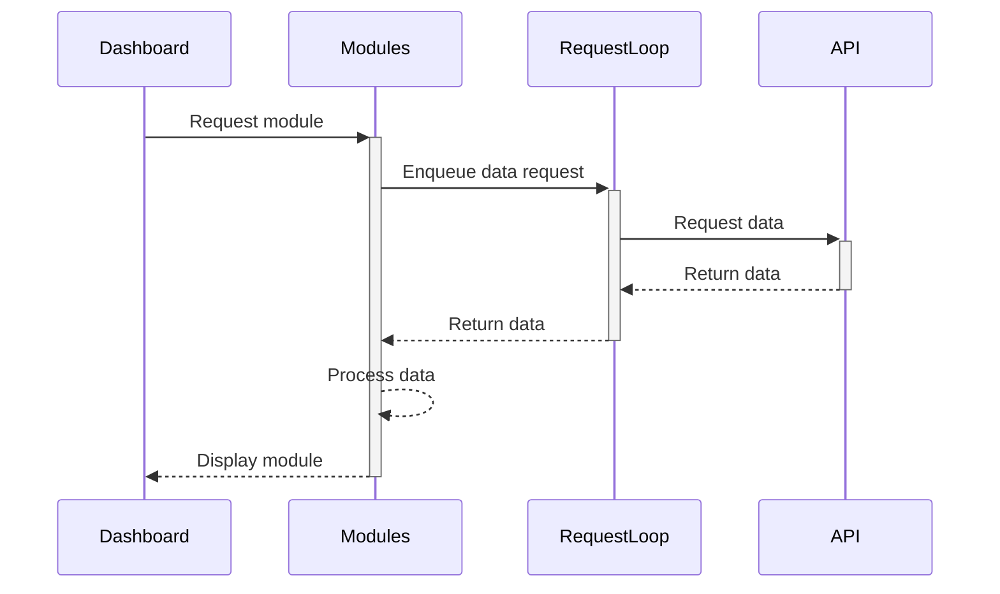

# Technical architecture documentation

## Technical solution

### RequestQueue & RequestLoop

42 API has very strict rate limit, therefore a FIFO queue is implemented to manage the requests to the API.

The RequestLoop is a background process that calls the API and returns the data to the modules.

## Deployment target

The project is gonna be deployed as a web application in Docker container.

The TV Screen will connect to it, on each connection the TV Screen will refresh the data from the API and display it on the screen.

## Tech-stack

Tech stack used in this project is:

- React (UI)
- Next.js (Routing, SSR)
- TailwindCSS (Styling)
- shadcn/ui (UI components)
- Docker (Containerization)

## Architecture diagram

